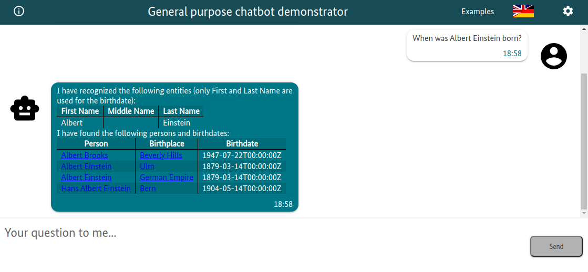
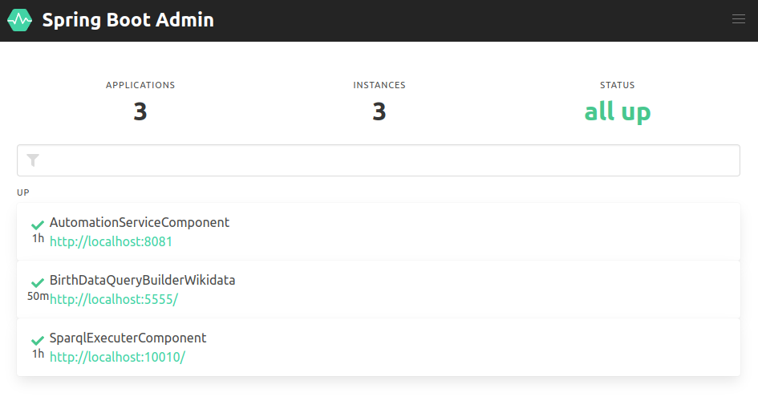

:toc:
:toclevels: 5
:toc-placement!:
:source-highlighter: highlight.js
ifdef::env-github[]
:tip-caption: :bulb:
:note-caption: :information_source:
:important-caption: :heavy_exclamation_mark:
:caution-caption: :fire:
:warning-caption: :warning:
:source-highlighter: coderay
endif::[]

# Integration Example of a Rasa Chatbot and a Qanary Question Answering System

The sole purpose of this repository is to provide a complete example of the integration of an integrated _generic chatbot UI_, a _Rasa chatbot_, and a _Qanary-driven question answering system_ (please recognize that the actual quality of the system is not in the focus).
The integration is done using a link:./Chatbot/actions[Rasa custom action] that passes the intended questions to the Qanary question answering system.
As a frontend, we use here a https://github.com/WDAqua/Qanary-Chatbot-UI[generic chatbot UI]. 
However, there are no specific requirements for the frontend.
Hence, you might use any other Rasa-compatible frontend (e.g., https://rasa.com/docs/rasa/connectors/your-own-website[a custom chatbot UI]) as well.

toc::[]

## Use Case 

The use case is the configured system is to compute the answer to a question about the birth date of a person. 
For example:

- Where and when was Albert Einstein born?
- Where was Albert Einstein born 
- when was Albert Einstein born?

The system is configured to answer the question using the following steps:

. Identify the firstname and lastname of the person using a NER, or NED, component
. Create a SPARQL query to query Wikidata for the birth date of the person
. Query Wikidata for the birth date of the person
. Prepare a HTML answer to the question to be displayed in the chatbot UI

ifdef::env-github[]
++++

   
  Example interaction: "When was Albert Einstein born?"

++++
endif::[]

ifndef::env-github[]
.Example interaction: "When was Albert Einstein born?"
[#img-ExampleInteraction] 

endif::[]

## Big Picture

The following figure shows the architecture.

[source,mermaid]
----
graph TD 

    Chatbot[<b>General Purpose Chatbot UI</b> provides an interactive frontend on port 3000]
    
    subgraph Rasa[Rasa Chatbot framework]
        direction TB
        RasaBackend[<b>Rasa chatbot backend</b> provides NLU and stories]
        RasaCustomAction[<b>Rasa Custom Action</b> provides a custom implementation for handing specific questions to the question answering functionality]
    end

    subgraph Qanary[Qanary question answering framework]
        direction TB
        QanarySystem[<b>Qanary System</b> orchestrates the connected Qanary components as demanded by the Rasa custom action]
        AutomationServiceComponent["<b>AutomationServiceComponent (Qanary component)</b> identifies names of persons in  a given question using a pre-trained  model (simple one, but functional)"]
        BirthDataQueryBuilderWikidata["<b>BirthDataQueryBuilderWikidata (Qanary component)</b> using the identified names,  it creates a SPARQL query that can  be used to fetch the requested  data from Wikidata"]
        SparqlExecuterComponent["<b>SparqlExecuterComponent (Qanary component)</b> executes the previously  computed SPARQL query on  Wikidata to fetch the  requested data"]
    end

    QanaryTriplestore["<b>Qanary Triplestore</b> stores all information for a question in a specific graph (i.e., a global QA process memory)  here: a demo service of the WSE research group is used (a Stardog triplestore)"]

    Wikidata["<b>Wikidata knowledge graph</b> <a href='https://query.wikidata.org/'>public SPARQL endpoint for querying RDF data</a>"]

    MLflow["<b>MLflow</b> logging of the training and usage  of the AutomationServiceComponent  (available on port 5000)"]
    AutomationServiceComponent-->|logs results|MLflow

    Chatbot -->|calls RESTful endpoint at port 5005| RasaBackend
    RasaBackend -->|calls RESTful endpoint at port 5055| RasaCustomAction
    RasaCustomAction -->|calls RESTful endpoint at port 8080| QanarySystem

    QanarySystem -->|1. calls| AutomationServiceComponent
    QanarySystem -->|2. calls| BirthDataQueryBuilderWikidata
    QanarySystem -->|3. calls| SparqlExecuterComponent

    AutomationServiceComponent-->|interact using SPARQL| QanaryTriplestore
    BirthDataQueryBuilderWikidata-->|interact using SPARQL| QanaryTriplestore
    SparqlExecuterComponent-->|interact using SPARQL| QanaryTriplestore

    SparqlExecuterComponent-->|interact using SPARQL| Wikidata

    classDef subgraphClass fill:#FFF,opastroke:#333,stroke:#999,stroke-width:1px,font-size:15px,font-weight:bold;
    classDef boxClass font-size:100%;
    linkStyle default stroke-width:2px,stroke:darkgray,fill:#FFFFFF00,color:black;

    class Qanary,Rasa subgraphClass
    class Chatbot,RasaBackend,RasaCustomAction,QanarySystem,AutomationServiceComponent,BirthDataQueryBuilderWikidata,SparqlExecuterComponent boxClass

----

## Starting the complete system using docker-compose

All components are orchestrated using a docker-compose file. 
The configuration is available at link:./docker-compose.yml[docker-compose.yml].
Use the following commands to build and start all components of this project.

[source,shell]
----
docker-compose build
docker-compose up
----

The configuration parameters are available in the file link:./.env[.env].

WARNING: The first time you start the system, it takes a while to download all required docker images. Additionally, please be aware that starting the Rasa chatbot service takes a while (you might check the availability of components using the URLs shown below).

### Troubleshooting: no gpu support

GPU support is enabled by default in the file link:./docker-compose.yml[`docker-compose.yml`] as it is useful for speeding up the training process of the link:#_components_of_the_architecture[AutomationServiceComponent].
If you get the following error message, you need to upgrade your Docker version or remove the GPU support from the docker-compose file.

----
ERROR: for automation_component  device_requests param is not supported in API versions < 1.40
----

Please see https://github.com/WSE-research/Qanary-NER-automl-component/blob/main/README.adoc#possible-errors for specific troubleshooting details.

Additionally, we provide a docker-compose file without requested GPU support at link:./docker-compose-nogpu.yml[`docker-compose-nogpu.yml`].
To start the system without GPU support, use the following commands.

[source,shell]
----
docker-compose -f docker-compose-nogpu.yml build
docker-compose -f docker-compose-nogpu.yml up
----

### Troubleshooting: new components' versions

The docker-compose file is configured to use the latest versions of the components.
The actual components' versions are shown in the console.
If you want to use a new (recently published) version of a component, you might need to force the docker-compose to pull the Docker images.

[source,shell]
----
docker-compose pull 
----

### Troubleshooting: Pipeline crashes due to Virtuoso errors
When first executing `docker-compose up` the Qanary pipeline may try to access the virtuoso instance before it is started. In this case, it helps to restart the pipeline. 

## Components of the architecture

The following components are integrated into this example.
Please recognize that the components are not part of this repository (links are provided for each component). 
In the following, the port numbers are shown for the default configuration of the docker-compose file.

* https://github.com/WDAqua/Qanary-Chatbot-UI[General Purpose Chatbot User Interface] available at http://localhost:3000/
** test the functionality: http://localhost:3000/?question=When%2520was%2520Albert%2520Einstein%2520born%253F%250A[When was Albert Einstein born?]

* https://rasa.com/[Rasa chatbot framework]
** https://rasa.com/docs/rasa/http-api[Rasa chatbot backend] available at  http://localhost:5005/
*** see the link:./Chatbot/[folder *Chatbot*] for the configuration of the Rasa chatbot backend
** https://rasa.com/docs/rasa/action-server[Rasa Custom Action service] available at http://localhost:5055/
*** see the link:./Chatbot/actions[folder *Chatbot/actions*] for the implementation of the custom action
*** test the availability at http://localhost:5055/health
* https://github.com/WDAqua/Qanary[Qanary question answering framework]
** https://github.com/WDAqua/Qanary[Qanary backend] available at http://localhost:8080/
*** test the availability at http://localhost:8080/actuator
*** see all available Qanary components of your QA system at http://localhost:8080/applications +

** Qanary components:
*** https://github.com/WSE-research/Qanary-NER-automl-component[AutomationServiceComponent] available at http://localhost:8081
*** https://github.com/WDAqua/Qanary-question-answering-components/tree/master/qanary-component-QB-BirthDataWikidata[BirthDataQueryBuilderWikidata] available at http://localhost:5555
*** https://github.com/WDAqua/Qanary-question-answering-components/tree/master/qanary-component-QE-SparqlExecuter[SparqlExecuterComponent] available at http://localhost:10010
* https://mlflow.org/[MLflow] available at http://localhost:5000/
